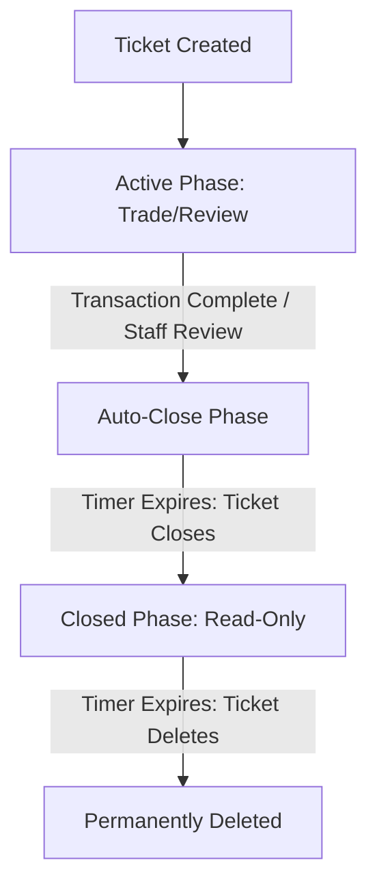

# 📖 ICN Bot - Full System Documentation & User Manual

Welcome to the official documentation for the **ICN Network Discord Bot**. This guide explains the complete architecture, channel structures, ticket lifecycles, configuration commands, database storage rules, and timings of all systems running on the server.

---

## 🗺️ Channel Structure & Workflows

Below is the mapping of which channels are used for which purposes, how they work, and what commands/interactions occur in them.

### 1. P2P Trading Channels (`USDT P2P System`)

| Channel Name | Purpose | How It Works / User Flow |
| :--- | :--- | :--- |
| **`#👀・looking-to-buy`** | USDT Buying Portal | Contains the Buy Panel. Users click **`🟢 Buy with KYC`** or **`🟢 Buy without KYC`**. Opens a private ticket. |
| **`#👀・looking-to-sell`** | USDT Selling Portal | Contains the Sell Panel. Users click **`🔴 Sell with KYC`** or **`🔴 Sell without KYC`**. Opens a private ticket. |
| **`#completed-transactions`** | Public Trade Proofs | The bot automatically posts the permanent **Successful Transaction** proof cards here when a deal is closed. |
| **`#feedback-comment`** | Vouch / Review Log | When users submit a vouch rating (1-5 stars + review comment), the feedback embed is posted here. |
| **`#transaction-snaps`** | Payment Receipts | Used by traders to upload screenshot proofs of payment. The bot redirects users here post-trade. |

### 2. KYC Verification Channels (`KYC Identity System`)

| Channel Name | Purpose | How It Works / User Flow |
| :--- | :--- | :--- |
| **`#kyc-verification`** | Start KYC Verification | Hosts the KYC panel with a **`🔒 Start KYC Verification`** button. |
| **`#kyc-logs`** | Staff Auditing Logs | Logs all user-submitted verification files and records who approved/rejected their KYC. |

### 3. User Reporting Channels (`Reporting System`)

| Channel Name | Purpose | How It Works / User Flow |
| :--- | :--- | :--- |
| **`#report-a-user`** | File User Complaints | Hosts the Report Panel with a native Discord User Dropdown. Staff can select a user to report. |
| **`#user-reports`** | Staff Incident Summary | Private channel for staff where the bot logs summaries of all submitted modal reports. |

---

## 🎫 Ticket Lifecycles, Timings, & Auto-Deletion

Here are the details of how, when, and where tickets are created, closed, and deleted.

### 1. P2P Buy & Sell Tickets
* **Category Location:** Created dynamically under the category matching `market`, `p2p`, or `portal` (defaults to the guild's generic ticket category if not found).
* **Channel Name:** `buy-<username>` or `sell-<username>`.
* **Targeted Clutter Clear:** As soon as the ticket is created, the bot searches `#looking-to-buy` & `#looking-to-sell` and **automatically deletes any text advertisements/offers previously sent by that specific user** to keep the channels clean.
* **Auto-Close Timer:** **30 Minutes** after the transaction complete message is triggered. This allows the buyer and seller to submit their vouch and upload snapshots.
* **Auto-Delete Timer:** **5 Minutes** after the channel is closed.
* **Total Lifecycle:** 35 Minutes from completed status to permanent channel deletion.

### 2. KYC Verification Tickets
* **Category Location:** Created dynamically under a category containing `kyc` or `verify`.
* **Channel Name:** `kyc-<username>`.
* **Auto-Close Timer:** **10 Minutes** after staff clicks either **`✅ Approve KYC`** or **`❌ Reject KYC`**.
* **Auto-Delete Timer:** **5 Minutes** after the channel is closed.
* **Total Lifecycle:** 15 Minutes from approval/rejection decision to permanent channel deletion.

### 3. User Report Tickets
* **Category Location:** Created dynamically under the category named **`Report Tickets`** (created automatically if missing).
* **Channel Name:** `report-<accused_username>`.
* **Permissions:** Exclusively visible to Server Admins, Staff, and the reporting user.
* **Close & Delete Timers:** Manual closing via `/ticket close` or standard ticket panels (no auto-timers to ensure staff can investigate incidents fully).

---

## 🤖 Bot Commands Reference

### 🛠️ P2P Commands (`Manage Server` / `Staff` only)

* **`/p2p setup`** (Admins Only)
  * **Channel:** Any channel.
  * **Options:** `deal_channel` (select channel for deal logs), `vouch_channel` (select channel for vouches), `staff_role` (who can assist trades), `footer` (custom text).
  * **Purpose:** Saves/updates server-wide P2P parameters in the PostgreSQL database.

* **`/p2p ticket-panel`** (Admins Only)
  * **Channel:** Run inside `#looking-to-buy` or `#looking-to-sell`.
  * **Options:** `title` (optional custom panel title), `channel` (optional override).
  * **Purpose:** Deploys the correct panel. The bot detects the channel name automatically:
    * In a buy channel, it deploys **`Buy with KYC`** and **`Buy without KYC`** buttons.
    * In a sell channel, it deploys **`Sell with KYC`** and **`Sell without KYC`** buttons.
    * In other channels, it deploys a combined **`Buy/Sell USDT`** panel.

* **`/p2p log-deal`** (Staff Only)
  * **Channel:** Inside a P2P ticket channel.
  * **Options:** `buyer` (optional), `seller` (optional).
  * **Purpose:** Manually scans the ticket chat to auto-detect USDT amount, payment method, and wallet address. Logs the completed deal to `#completed-transactions` and triggers the vouch request flow.

* **`/p2p payment`** (Admins Only)
  * **Channel:** Any channel.
  * **Purpose:** Configures the default payment accounts (UPI ID, IMPS Details, Crypto addresses) for automated middleman display embeds.

---

### 🔒 KYC Commands (`Manage Server` / `Staff` only)

* **`/kyc setup`** (Admins Only)
  * **Options:** `verified_role`, `panel_channel` (channel for KYC guide portal), `review_category`, `log_channel`.
  * **Purpose:** Saves verification configuration to the database.

* **`/kyc panel`** (Admins Only)
  * **Channel:** `#verify-yourself` or `#kyc-verification` (or auto-deployed automatically).
  * **Purpose:** Sends the official KYC portal welcome embed accompanied by the visual **KYC Verification Guide** image and the **`🔒 Start KYC Verification`** button.

* **`/kyc approve`** & **`/kyc reject`** (Staff Only)
  * **Options:** `user` (user to review), `reason` (rejection reason).
  * **Purpose:** Manually updates a user's KYC status from the console.

---

## ⚡ Automated Security & Anti-Spam Systems

### 1. 🚫 Anti-Spam Auto-Timeout
* **Target Channels:** `#p2p-chat` and `#chat-box`.
* **Rules & Detection:**
  * **Rate Limit:** 5 messages within 4 seconds.
  * **Duplicate Spam:** 4 identical/duplicate messages consecutively.
* **Auto-Mute Action:**
  * The user is put in a native Discord **2-hour Timeout** (cannot type in any channel).
  * The bot deletes all recent spam messages sent by that user in the channel.
  * Posts a warning message in the channel (which automatically deletes after 10 seconds).
  * Logs the mute details in the staff log channel.

### 2. 🧹 Channel Clutter Controls
* **P2P Portal Channels (`#looking-to-buy`, `#looking-to-sell`):**
  * If a regular user sends any text message here, the bot deletes it instantly and posts the panel if missing.
  * Admin/Owner text messages and announcements are preserved.
* **Report Channel (`#report-a-user`):**
  * Regular users cannot type here; any messages sent are deleted instantly.
  * Only interaction via the native Select Menu is allowed.

---

## 💾 Database Storage Schema (PostgreSQL)

All bot configuration and statistics are saved in the persistent PostgreSQL database. If PostgreSQL becomes temporarily unavailable, the bot degrades gracefully to secure, temporary in-memory storage.

1. **Guild Configuration Keys (`guild:{guildId}:p2p:config`):**
   * Stores channel IDs for logging deals, vouches, price panels, and role IDs for staff.
2. **P2P Deal Records (`p2p:deals:${dealId}`):**
   * Stores unique transaction stats: Deal ID, Buyer ID, Seller ID, USDT amount, USD value, txHash, and transaction timestamp.
3. **P2P User Stats (`p2p:user:${userId}`):**
   * Tracks total completed USDT deals, volume, and ratings for each trader.
4. **KYC Verification Status (`kyc:status:${guildId}:${userId}`):**
   * Stores current verification state (`verified`, `pending`, `rejected`), submission links/attachments, reviewer ID, and timestamps.
